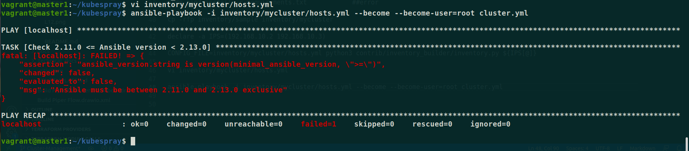
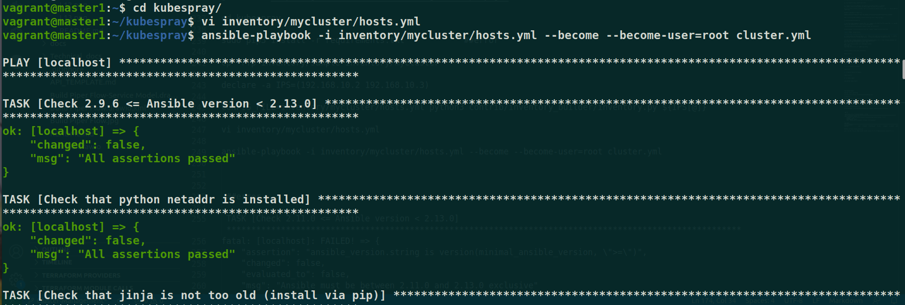
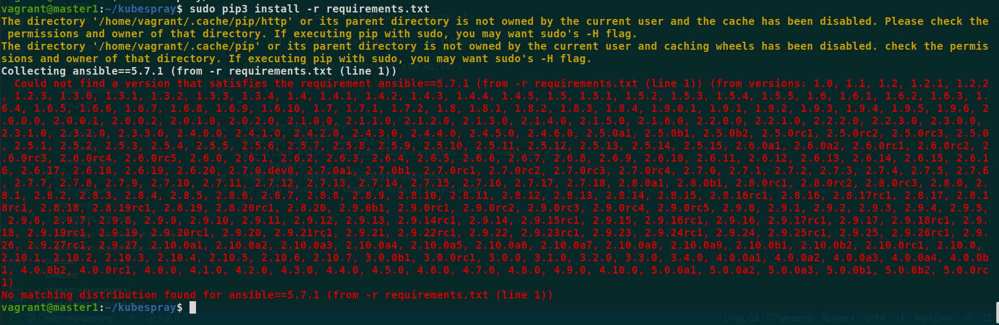
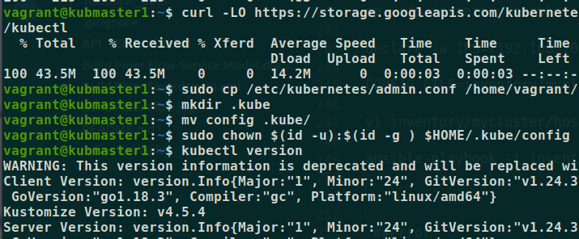
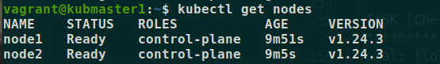
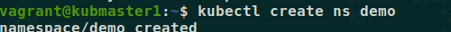
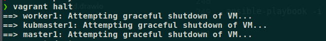
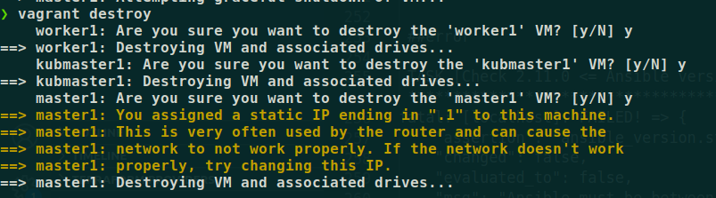
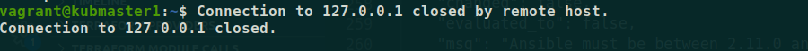

#### Cluster Management Using Kubespray


### What is Kubespray ?

Kubespray is a composition of Ansible playbooks, inventory, provisioning tools, and domain knowledge for generic OS/Kubernetes clusters configuration management tasks. 

Kubespray provides: 

* Highly available cluster. 
* Composable (Choice of the network plugin for instance).


### What is Vagrant ?

Vagrant is a tool for building and managing virtual machine environments in a single workflow. With an easy-to-use workflow and focus on automation, Vagrant lowers development environment setup time, increases production parity, and makes the "works on my machine" excuse a relic of the past.


### How to use Kubespray  For Installing a Kubernetes Cluster


Lets see How we can create and manage cluster using kubespray :

1. Create one Directory in your local and create one file named as "Vagrantfile":

```
mkdir kubespray

nano Vagrantfile
```

2. Update & Install vagrant 

```
sudo apt update 

sudo apt install vagrant 
```

3. Starting Vagrant 

```
vagrant up
```

**NOTE** :  ERROR - if you get error regarding range so you should change the range or Ip of your Vagrantfile.



4. Connecting to Ansible master1 , Kubmaster1 & worker1 node using command :

```
vagrant ssh master1 (# ansible master)

vagrant ssh kubmaster1 (# kubernetes master)

vagrant ssh worker1 (# worker node )
```

5. After starting the vagrant box you need to update the "/etc/hosts" file on each node .i.e master1, kubmaster1, worker1

**So run the following command on all the three nodes**

```
sudo vim /etc/hosts

and add-

192.168.10.1 master1.knoldus.com master 1

192.168.10.2 kubmaster1.knoldus.com kubmaster1 

192.168.10.3 worker1.knoldus.com worker1
```

**cat files: cat into these files to recheck the things added**

```
cat /etc/hosts
```

7. Generate SSH key for ansible (only need to run on ansible node .i.e. master1)
To setup the kubespray smoothly we need to generate the SSH keys for the ansible master(master1) nodes and copy the ssh keys to other nodes. So that you do not have to provide username and password everytime you login/ssh into the other nodes .i.e. - kubmaster1, worker1.

Generate SSH key (during the ssh key generation it might will ask for passphrase so either you create a new passphrase or leave it empty)-

```
ssh-keygen -t rsa
```

8. Copy SSH key to other nodes .i.e. - kubmaster1, worker1

we have generated the SSH keys, now we need to copy the SSH keys to other nodes .i.e. kubmaster1, worker1

Copy to kubmaster1 node (During the ssh-copy-id it will ask for the other node password, so in case if you have not set any password then you can supply default password .i.e. vagrant) -

```
ssh-copy-id <kubmaster1 id , worker id>
```


9. Updating & Installing certain things as:

* Install python3-pip (only need to run on ansible node .i.e. master1). Before installing the python3-pip, you need to download and update the package list from the repository.

Run the following command(on all the nodes)

```
sudo apt-get update
```

* Now you need to install the python3-pip, use the following installation command to install the python3-pip (only need to run on ansible node .i.e. master1)

```
sudo apt install python3-pip
```

* After the installation verify the python and pip version

```
python -V

Python 2.7.15+
```

10. Clone the kubespray git repo (only need to run on ansible node .i.e. master1)
In the next step we are going to clone the kubespray. Use the following git command to clone kubespray

```
git clone https://github.com/kubernetes-sigs/kubespray.git
```

11. Install kubespray package from "requirement.txt" (only need to run on ansible node .i.e. master1)

* Goto "kubespray" directory

```
cd kubespray
```

* Install the kubespray packages

```
sudo pip3 install -r requirements.txt
```

12. Copy inventory file to current users (only need to run on ansible node .i.e. master1) .Now we need to copy the inventory file to current user using the following command:

```
cp -rfp inventory/sample inventory/mycluster
```

13. Prepare host.yml for kubespray (only need to run on ansible node .i.e. amaster) . This step is little trivial because we need to update host.yml with the nodes IP.

Now we are going to declare a variable "IPS" for storing the IP address of other nodes .i.e. kmaster(100.0.0.2), kworker(100.0.0.3)

```
declare -a IPS=(100.0.0.2 100.0.0.3)

CONFIG_FILE=inventory/mycluster/hosts.yml python3 contrib/inventory_builder/inventory.py ${IPS[@]}
```

After running the above commands do verify the hosts.yml and it should be like -

```
vi inventory/mycluster/hosts.yml
```

14. Run the ansible-playbook on ansible node .i.e. - amaster (only need to run on ansible node .i.e. amaster).Now we have done all the prerequisite for running the ansible-playbook.

* Use the following ansible-playbook command to begin the installation

```
ansible-playbook -i inventory/mycluster/hosts.yml --become --become-user=root cluster.yml
```



**NOTE**: ERROR : Ansible version 



15. Install kubectl on kubernetes master .i.e. - kubmaster1 (only need to run on kuebernets node .i.e. kubmaster1)

* Now you need to log into the kubernetes master .i.e. kubmaster1 and download the kubectl onto it.

```
curl -LO https://storage.googleapis.com/kubernetes-release/release/`curl -s https://storage.googleapis.com/kubernetes-release/release/stable.txt`/bin/linux/amd64/kubectl
Now we need to copy the admin.conf file to .kube

sudo cp /etc/kubernetes/admin.conf /home/vagrant/config

mkdir .kube

mv config .kube/

sudo chown $(id -u):$(id -g ) $HOME/.kube/config
```

* Check the kubectl version after installation

```
kubectl version
```




15. Verify the kubernetes nodes
Now we have done all the required steps for the installing kubernetes using kubespray.

Lets check the nodes status in out final step

```
kubectl get nodes
```


```
kubectl create ns demo
```



16. To stop vagrant run command:

```
vagrant halt
```



17. To destroy vagrant use command:

```
vagrant destroy
```



28. to remove vagrant 

```
sudo apt-get remove vagrant
```

**NOTE:** After Destroying Vagrant you will see your connection is closed as:




